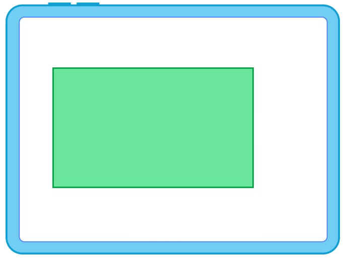

<p align="center">
  
</p>

<h1 align="center">Windows Rectangle</h1>

<p align="center">
  <strong>🪟 Snap windows into place with keyboard shortcuts — Rectangle for Windows.</strong>
</p>

<p align="center">
  <a href="https://github.com/yanmad27/windows-rectangle/releases"></a>
  <a href="https://github.com/yanmad27/windows-rectangle/actions"></a>
  <a href="#license"></a>
  <a href="https://github.com/yanmad27/windows-rectangle"></a>
  <a href="https://www.rust-lang.org"></a>
</p>

<p align="center">
  <a href="#-quick-start">Quick Start</a> •
  <a href="#-features">Features</a> •
  <a href="#%EF%B8%8F-hotkeys">Hotkeys</a> •
  <a href="#-build-from-source">Build</a> •
  <a href="#-architecture">Architecture</a> •
  <a href="#-contributing">Contributing</a>
</p>

---

## 🚀 Quick Start

1. **Download** the latest `windows-rectangle-*.exe` from the [Releases](https://github.com/yanmad27/windows-rectangle/releases) page
2. **Double-click** to run — a blue square icon appears in the system tray
3. **Start snapping** windows with `Ctrl + Alt + Arrow Keys`

> 💡 **Start on login:** Drop a shortcut into `shell:startup`
>
> 🛑 **Quit:** Right-click the tray icon → **Quit**

---

## ✨ Features

| | Feature | Description |
|---|---|---|
| 🔲 | **Halve Snapping** | Snap windows to left / right / top / bottom half |
| 🔳 | **Quarter Snapping** | Pin windows to any corner of the screen |
| 🔁 | **Multi-Monitor Cycling** | Press the same direction again to jump to the next monitor |
| ⬆️ | **Maximize & Restore** | Toggle maximize, center, or restore previous size |
| 📐 | **DPI Aware** | Per-monitor DPI scaling — crisp on mixed displays |
| 🖥️ | **System Tray** | Menu lists every binding; clicks act on the last-focused window |
| 📦 | **Portable** | Single ~1–2 MB exe, no installer needed |

---

## ⌨️ Hotkeys

All shortcuts use the `Ctrl + Alt` modifier:

### Window Halves

| Shortcut | Action | Repeat Behavior |
|:---:|---|---|
| <kbd>Ctrl</kbd> + <kbd>Alt</kbd> + <kbd>←</kbd> | Halve Left | → Previous monitor |
| <kbd>Ctrl</kbd> + <kbd>Alt</kbd> + <kbd>→</kbd> | Halve Right | → Next monitor |
| <kbd>Ctrl</kbd> + <kbd>Alt</kbd> + <kbd>↑</kbd> | Halve Top | — |
| <kbd>Ctrl</kbd> + <kbd>Alt</kbd> + <kbd>↓</kbd> | Halve Bottom | — |

### Window Quarters

| Shortcut | Action |
|:---:|---|
| <kbd>Ctrl</kbd> + <kbd>Alt</kbd> + <kbd>U</kbd> | Quarter Top-Left |
| <kbd>Ctrl</kbd> + <kbd>Alt</kbd> + <kbd>I</kbd> | Quarter Top-Right |
| <kbd>Ctrl</kbd> + <kbd>Alt</kbd> + <kbd>J</kbd> | Quarter Bottom-Left |
| <kbd>Ctrl</kbd> + <kbd>Alt</kbd> + <kbd>K</kbd> | Quarter Bottom-Right |

### Window Management

| Shortcut | Action |
|:---:|---|
| <kbd>Ctrl</kbd> + <kbd>Alt</kbd> + <kbd>Enter</kbd> | Maximize / Restore toggle |
| <kbd>Ctrl</kbd> + <kbd>Alt</kbd> + <kbd>C</kbd> | Center window |
| <kbd>Ctrl</kbd> + <kbd>Alt</kbd> + <kbd>R</kbd> | Restore previous size |

> **Note:** Hotkeys are currently hardcoded. A config file / settings GUI may come in a future release.

---

## 🔨 Build from Source

### Prerequisites

- [Rust](https://rustup.rs/) stable toolchain
- Target: `x86_64-pc-windows-msvc`

### Build

```cmd
cargo build --release --target x86_64-pc-windows-msvc
```

The binary lands at `target\x86_64-pc-windows-msvc\release\windows-rectangle.exe`.

### Cross-Platform Check

You can verify the code compiles from any OS:

```sh
cargo check --target x86_64-pc-windows-msvc
```

### Run Tests

Platform-agnostic logic is fully unit-tested and runs on any OS:

```sh
cargo test --lib
```

---

## 🏗 Architecture

```
src/
├── geometry.rs      # Pure rect math (halve, quarter, center)
├── adjacency.rs     # Multi-monitor neighbor detection
├── cycle_state.rs   # Repeat-press → next monitor logic
├── bindings.rs      # Hotkey → Action mapping table
├── lib.rs           # Public library crate
├── main.rs          # Entry point
└── win/             # Win32 platform layer (cfg-gated)
    ├── monitor      #   EnumDisplayMonitors
    ├── window_ops   #   SetWindowPos, restore stack
    ├── foreground   #   Real foreground window cache
    ├── hotkey       #   RegisterHotKey / WM_HOTKEY
    ├── dispatcher   #   Action router with cycle state
    └── tray         #   System tray icon & menu
```

**Design principles:**
- Pure-Rust geometry, adjacency, repeat-cycle state, and bindings — **platform-agnostic** and fully unit-tested
- Win32 modules gated under `#[cfg(target_os = "windows")]`
- `winit` hosts a hidden message window; `RegisterHotKey` posts `WM_HOTKEY`; `SetWinEventHook(EVENT_SYSTEM_FOREGROUND)` caches the real foreground window so tray clicks dispatch to the prior app

> 📄 See [`docs/plans/`](docs/plans/) for the full design and implementation plan.

---

## 🤝 Contributing

Contributions are welcome! Here's how to get started:

1. **Fork** the repository
2. **Create** a feature branch: `git checkout -b feat/my-feature`
3. **Commit** your changes: `git commit -m "feat: add my feature"`
4. **Push** to the branch: `git push origin feat/my-feature`
5. **Open** a Pull Request

Please make sure `cargo test --lib` passes before submitting.

---

## 📄 License

This project is licensed under the [MIT License](LICENSE).

---

<p align="center">
  <sub>Inspired by <a href="https://rectangleapp.com">Rectangle</a> for macOS · Built with ❤️ in Rust</sub>
</p>
